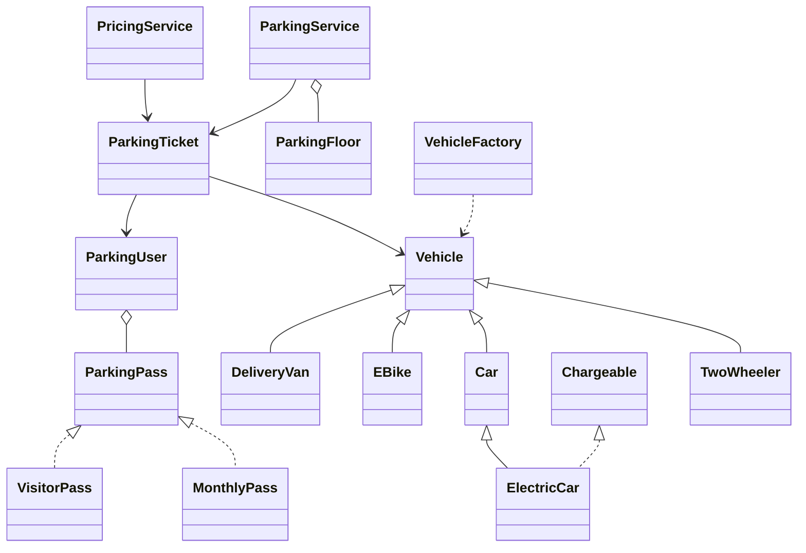

# Campus Parking Class Diagram

```mermaid
classDiagram
  Vehicle <|-- TwoWheeler
  Vehicle <|-- Car
  Car <|-- ElectricCar
  Vehicle <|-- EBike
  Vehicle <|-- DeliveryVan
  Chargeable <|.. ElectricCar
  ParkingPass <|.. MonthlyPass
  ParkingPass <|.. VisitorPass
  ParkingUser o-- ParkingPass
  ParkingTicket --> Vehicle
  ParkingTicket --> ParkingUser
  ParkingService o-- ParkingFloor
  ParkingService --> ParkingTicket
  VehicleFactory ..> Vehicle
  PricingService --> ParkingTicket
```

This diagram reflects the integrated implementation in `src/campusparking`.
