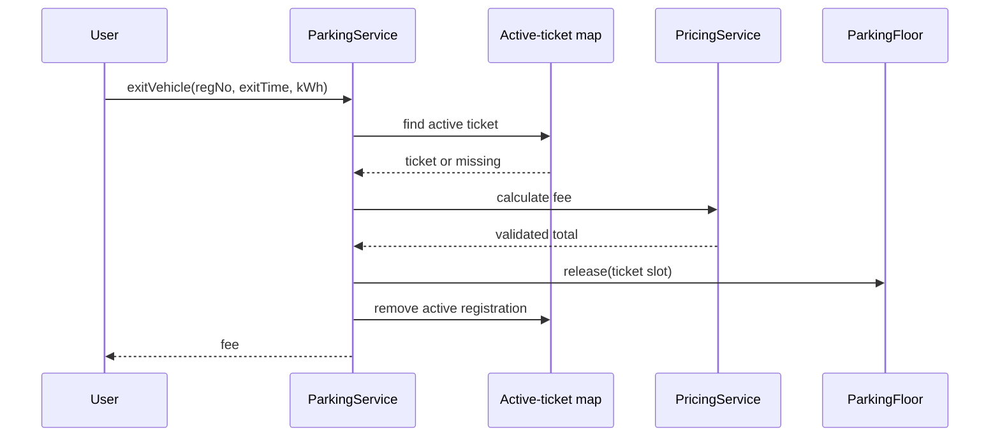

# Vehicle Exit Sequence

```mermaid
sequenceDiagram
  participant U as User
  participant S as ParkingService
  participant M as Active-ticket map
  participant P as PricingService
  participant F as ParkingFloor
  U->>S: exitVehicle(regNo, exitTime, kWh)
  S->>M: find active ticket
  M-->>S: ticket or missing
  S->>P: calculate fee
  P-->>S: validated total
  S->>F: release(ticket slot)
  S->>M: remove active registration
  S-->>U: fee
```
